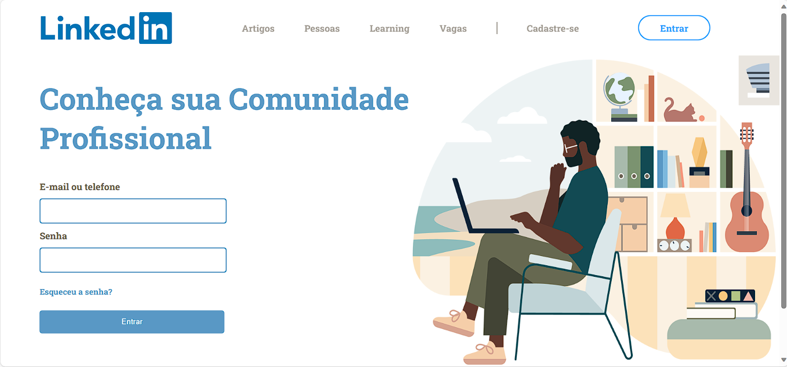

<h1 align="center"> UI Clone de interface do linkedin </h1>

Estudando tecnologias WEB Frontend  

  <a href="#-tecnologias">Tecnologias</a>&nbsp;&nbsp;&nbsp;|&nbsp;&nbsp;&nbsp;
  <a href="#-projeto">Projeto</a>&nbsp;&nbsp;&nbsp;|&nbsp;&nbsp;&nbsp;
  <a href="#-layout">Layout</a>&nbsp;&nbsp;&nbsp;|&nbsp;&nbsp;&nbsp;
  <a href="#memo-licença">Licença</a>

  

 

  

 

## 🚀 Tecnologias

Esse projeto foi desenvolvido com as seguintes tecnologias:

- HTML e CSS
- JavaScript
- Git e Github

## 💻 Projeto

Linkedin é uma plataforma de rede social profissional a qual você demostra sua habilidades, certificações, cursos e experiência profissional em determinada área.

- [Acesse o projeto finalizado, online](https://#)

- [Assistir aulas](https://#)

## 🔖 Layout

Você pode visualizar o layout do projeto através [DESSE LINK](https://www.figma.com/file/tblkiNsedyNDA9VPRktgWT/UI---Linkedin?type=design&node-id=0%3A1&mode=design&t=jEziFcvof1F2c9tS-1). É necessário ter conta no [Figma](https://figma.com) para acessá-lo.

<!-- ## :memo: Licença -->
